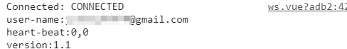

# Spring boot Websocket 使用 JWT 做身分驗證進行點對點或廣播消息推送

<br>

標題有點長，不過已經很能表達清楚重點了，關於 __Spring boot Websocket 使用 JWT 做身分驗證進行點對點或廣播消息推送__ 的部分，國內是找不到任何文件了，中國大陸那邊或多或少也有，不過交代的也是不清不楚，中文好像還沒有一個比較能說明清楚的的文件，所以我在這邊卡關了將近 1 個月，這期間頻繁撞牆也做做停停，終於在某一次嘗試下搞定了這一個問題。

<br>

感謝全世界的 Java 開發者們對社群的貢獻，這邊也附上最終點醒我的文章出處 : 

<br>

[\<Building Persistable One-to-One Chat Application using Spring Boot and WebSockets\>](https://medium.com/javarevisited/building-persistable-one-to-one-chat-application-using-spring-boot-and-websockets-303ba5d30bb0) by -- Amr Khaled

<br>

下面進入正文 (順帶一提，我是以　Spring Boot 2.x 做範例的，就單論 WebSocket 的部分與 1.x 版本大同小異但還是稍有區別。還是要稍加注意)

<br>
<br>

------------------------

<br>
<br>

## 問題描述

<br>

這次的需求是要做一個使用者的消息推送系統，就像 Facebook 一樣，在有新消息，被標註，或者好友申請時會接收到 Server 推送來的資訊。這邊使用 Websocket 來做，前端搭配 vue.js。我們要推送的東西是消息數量 : 

<br>


<br>

我們的系統並不是使用一般的 session 做 Auth，而是進階的 JWT，關於 JWT 可以參考我寫的 spring boot security 部分。所以在 Websocket 身分驗證上要多下一點功夫才可以。

這邊我並不打算把整個實作全部寫進來，只會抓關鍵的東西放，如果全部都放進來東西太多了。

<br>

構想如下 : 

* 客戶端訂閱 Server 上的一個 Topic，並在一開始進行握手協議時就做身分驗證。

* 當 Server 上產生了一個新的消息需要推送給指定 User 時，就可以一對一的推送給專屬 User。

<br>
<br>
<br>
<br>

## 開始實作

<br>

首先先來看一下 Controller 裡面的 api 細節

<br>

```java
@RestController
@RequestMapping("/following")
public class FollowingController {

    @Autowired
    FollowingService followingService;

    @PreAuthorize("hasRole('USER')")
    @GetMapping("/send/request")
    public ResponseEntity<?> sendFollowingRequest(@CurrentUser UserPrincipal principal,
                                                  @RequestParam(name = "fowllowingUserId") Long followingUserId){
        Long userId = principal.getId();
        followingService.createFollowing(userId, followingUserId);
        return ResponseEntity.ok(new ApiResponse<>(true, "追蹤請求已送出", null));
    }

}
```

這個是當某一個 User 想要追蹤另一個 User 時可以使用的 API，只需要提供自己的身分驗證以及想要追蹤的 User 的 `userId` 即可。接下來看看 followingService 的實作部分。

<br>

```java
@Service
public class FollowingServiceImpl implements FollowingService {

    @Autowired
    UserRepository userRepository;

    @Autowired
    FollowingRepository followingRepository;

    @Autowired
    UserNoticeRepository userNoticeRepository;

    @Autowired
    PushNoticeService pushNoticeService;

    @Override
    @Transactional
    public void createFollowing(Long requesterId, Long followingUserId) {
        User requester = userRepository.getOne(requesterId); // 追蹤請求發起者
        Optional<User> targetOptional = userRepository.findById(followingUserId); // 被追蹤者
        targetOptional.ifPresent(targetUser -> {  // 如果被追蹤者真實存在的話做以下動作
            Following following = new Following(); // 建立一筆追蹤紀錄
            following.setFollowingPrimarykey(new FollowingPrimarykey(requesterId, followingUserId));
            following.setUser(requester);
            following.setFollowingUser(targetUser);
            following.setAccepted(targetUser.isActivelyAcceptFollowRequest());
            followingRepository.save(following); // 寫入 DB

            if (!following.isAccepted()) { // 如果追蹤目標是一個非公開帳號做以下動作
                Optional<UserNotice> targetUserNotice = userNoticeRepository.findById(targetUser.getId()); //取出目標 user 的消息數量紀錄

                // 下面是更新目標 user 的消息數量邏輯，不多做解釋
                UserNotice userNotice;
                if (targetUserNotice.isEmpty()){
                    userNotice = new UserNotice();
                    userNotice.setUser(targetUser);
                    userNotice.setChatNoticeCount(0);
                    userNotice.setEventNotiveCount(0);
                    userNotice.setFollowingNoticeCount(1);
                }else{
                    userNotice = targetUserNotice.get();
                    userNotice.setFollowingNoticeCount(userNotice.getFollowingNoticeCount() + 1);
                }

                userNoticeRepository.save(userNotice); //將更新後的消息寫入 DB

                UserNoticeCount noticeCount = new UserNoticeCount();
                BeanUtils.copyProperties(userNotice, noticeCount);

                // 這邊是重點，在這邊把 noticeCount 推送給目標 user。
                pushNoticeService.sendUserNoticeCount(targetUser.getEmail(), noticeCount);
            }
        });

        if (targetOptional.isEmpty()){
            throw new ResourceNotFoundException("追蹤用戶不存在");
        }
    }
}
```

<br>

以上的部分是消息產生的部分，一些細節都已經以註解的方式寫在 code 裡面了。都蠻好理解的。接下來進入重頭戲。我們要來設置 WebSocket 了。

<br>
<br>

首先看一下 pom 依賴 : 

```xml
    ...

<dependency>
    <groupId>org.springframework.boot</groupId>
    <artifactId>spring-boot-starter-websocket</artifactId>
    <version>${spring.boot.version}</version>
</dependency>

    ...
```

Spring Boot Websocket 需要這一個依賴，其他相關的 web 和 security 之類的我就不放進來了，以免偏題。

<br>
<br>

開始設置 Websocket :

```java
@Configuration
@EnableWebSocketMessageBroker // 開啟 websocket 消息代理功能，包括配置 SimpleMessageingTemplate Bean。
public class WebSocketConfig implements WebSocketMessageBrokerConfigurer {

    @Autowired
    private TokenProvider tokenProvider;
    @Autowired
    private CustomUserDetailsService customUserDetailsService;

    @Override
    public void configureMessageBroker(MessageBrokerRegistry registry) {
        registry.enableSimpleBroker("/topic"); // 消息代理終點。Client 可以訂閱這裡獲取訊息。
        registry.setApplicationDestinationPrefixes("/app"); // 消息處理器 prefix
        registry.setUserDestinationPrefix("/user"); // 推送 user prefix (大重點 !!! 要使用 convertAndSendToUser 函數必須要設定這一個)
    }

    @Override
    public void registerStompEndpoints(StompEndpointRegistry registry){
        registry.addEndpoint("/endpont") // 提供給 SockJS 的端點
                .setAllowedOrigins("http://localhost:3000") // 跨域設定，填入你的前端server IP
                .withSockJS(); // 開啟支援 SockJS。
    }

    // WebSocket 身分驗證核心
    @Override
    public void configureClientInboundChannel(ChannelRegistration registration) {
        registration.interceptors(new ChannelInterceptor() {
            @Override
            public Message<?> preSend(Message<?> message, MessageChannel channel) {
                StompHeaderAccessor accessor = MessageHeaderAccessor.getAccessor(message, StompHeaderAccessor.class);
                if (StompCommand.CONNECT.equals(accessor.getCommand())) { // 如果STOMP Header 是要來做 CONNECT 的話，執行下面動作。
                    String bearerToken = accessor.getFirstNativeHeader("Authorization"); // 取出 Bearer Token
                    System.out.println("bearerToken: " + bearerToken);

                    // 由 JWT 進行身分驗證工作，不是本篇重點所以不過多解釋。
                    if (StringUtils.hasText(bearerToken) && bearerToken.startsWith("Bearer ")) {
                        Map sessionAttributes = SimpMessageHeaderAccessor.getSessionAttributes(message.getHeaders());
                        sessionAttributes.put(CsrfToken.class.getName(), new DefaultCsrfToken("Authorization", "Authorization", bearerToken));
                        String jwt = bearerToken.substring(7, bearerToken.length());
                        if (StringUtils.hasText(jwt) && tokenProvider.validateToken(jwt)){
                            Long userId = tokenProvider.getUserIdFromToken(jwt);
                            String securityCode = tokenProvider.getUserSecurityCodeFromToken(jwt);

                            // 使用 JWT 中的 userId 資訊建立 UserPrincipal 物件
                            UserPrincipal userPrincipal = customUserDetailsService.loadUserById(userId);
                            if (userPrincipal.getSecurityCode().equals(securityCode)) {
                                UsernamePasswordAuthenticationToken authentication = new UsernamePasswordAuthenticationToken(userPrincipal, null, userPrincipal.getAuthorities());
                                // Spring Security Context 身分注入。
                                SecurityContextHolder.getContext().setAuthentication(authentication);
                                // WebSocket 身分注入。
                                accessor.setUser(authentication);
                                System.out.println("在Interceptor中的 Name : " + authentication.getName());
                            }
                        }
                    }
                }
                return message;
            }
        });
    }

}

```

<br>

看過一個大概之後，可以了解到其實就是在通訊連接時在 preSend 階段嵌入一個 Interceptor。這個 Interceptor 負責做身分驗證綁定。

東西又有點多，但是其實種重點就那幾個，大部分我都寫在註解裡面了，還是在挑一些出來單獨講講。

* ```registry.setUserDestinationPrefix("/user");```

    關於這一段，把我害超慘的，之前一直沒有加入這一段，導致我沒辦法點對點推送消息。後來加上了之後，在客戶端訂閱時又忘記加入 "/user" 前綴，導致無限撞牆卡關。

<br>

* ```.setAllowedOrigins("http://localhost:3000")```

    跨域設定，這邊我應該不想多說的，關於跨域是一個蠻基本的問題，如果不想設限的話可以用這個參數 :　```"*"```，這樣就不會被限制了。

<br>

* ```String bearerToken = accessor.getFirstNativeHeader("Authorization");```

    WebSocket 並不是一開始就馬上進行連線的，事實上在正式連線之前 Client 會送出一個 Http 請求給 Server。我們的身分驗證與綁定就應該要在這個階段完成。這邊取出的是 NativeHeader ，並不是 HttpRequestHeader，而是 Stomp 專屬的 Header。關於在客戶端怎麼放入 Authorization 資訊後面會講到。

<br>

* ```accessor.setUser(authentication);```

    這一步就正式的把身分綁定到 Socket 連線上了，在成功連線之後，Client 端會接收到 UserName 資訊。

    

<br>
<br>

那麼以上就是關於 Config 的設定。接下來就來看看如和設計 Service。

<br>
<br>
<br>
<br>

實作消息推送服務 : 

```java
@Service
public class PushNoticeServiceImpl implements PushNoticeService {

    @Autowired
    SimpMessagingTemplate simpMessagingTemplate; // 已經被自動建立 Bean 加入到上下文中

    @Override
    public void sendUserNoticeCount(String to, UserNoticeCount userNoticeCount) {
        simpMessagingTemplate.convertAndSendToUser(to, "/topic/response", userNoticeCount);
        //simpMessagingTemplate.convertAndSend("/topic/response", userNoticeCount);
        System.out.println("訊息送出: " + to);
    }
}
```

<br>

這是一個個自訂的 Service。有一些細節會再下面拉出來說明 :

```java
@Autowired
SimpMessagingTemplate simpMessagingTemplate;
```

在前面 WebSocketConfig 裡面我們有開啟 `@EnableWebSocketMessageBroker`，它會自東幫我們裝配一個 `SimpMessagingTemplate` Bean 到上下文中供我們使用。這也是 Spring Boot 約定大於配置的理念，蠻方便的。

<br>

```java
simpMessagingTemplate.convertAndSendToUser(to, "/topic/response", userNoticeCount);
```

這裡就是整篇文章的核心了，寄送消息給指定 User，第一個參數 `to` 是寄送目標的 name，這個功能基本上是搭配 Spring Security 使用的，你的 UserDetails 實作裡面怎麼定義的 `getUsername()` 方法，就要在這邊給相同的東西。舉例來說，我的 UserDetails 實作 class 如下 : 

```java
public class UserPrincipal implements UserDetails {

    private Long id;
    private String email;
    private String password;

    ...略

    @Override
    public String getPassword() {
        return password;
    }

    @Override
    public String getUsername() {
        return email;
    }

    ...略
```

我在 `UserPrincipal` 對 `getUsername()` 的定義是其 Email，所以我在往指定 user 寄送消息時，用的也應該要是 Email。

<br>

第二個參數 `"/topic/response"`，這一個參數是給訂閱者可以訂閱的一個 Topic，所有 user 可以訂閱這個 Topic，當有屬於自己的消息時就會接收的到。

<br>

最後一個參數 `userNoticeCount` 就是我們要傳遞給 User 的訊息了，它可以是一個 Bean，當然最後會以 json 的格式回傳給 User。

<br>
<br>

另外可已看到我還有註解起來一段 code : 

```java
simpMessagingTemplate.convertAndSend("/topic/response", userNoticeCount);
```

這一段 code 是以廣播的形式發送消息，沒有特定指定 user，只要有訂閱的全部發送。這邊還又一個很重要很重要的點沒有說。下面請注意!!!!!

<br>

__我們 convertAndSend() 方法以及 convertAndSendToUser() 兩者雖然都是指定 Topic 為 `/topic/response` 但是使用用者訂閱 Topic 時是不一樣的，還記得我們在 WebSocketConfig 那邊說到的 `registry.setUserDestinationPrefix("/user")` 嗎 ? 這邊就派上用場了，當 User 們要訂閱可以指名傳遞消息的 Topic 時，前綴必須加入 `"/user"`，所以完整路徑會像這樣 : `"/user/topic/response"`__，換而言之，如果 User 要訂閱廣播，就不用加入任何前餟，直接這樣 : `"/topic/response"` 就好。

<br>

以上就是我們 java 後端的的重要實作細節。接下來會講一下前端的工作。

<br>
<br>
<br>
<br>

在 vue.js 中 :

```js
<template>
    <div>
        <h1>hello world ws</h1>

        <div>
            <button @click="connect">連線</button>
            <button @click="disconnect">斷開</button>
        </div>

        <div id="response">
            {{responseMsg}}
        </div>

    </div>
</template>

<script>
    import SockJS from  'sockjs-client';
    import  Stomp from 'stompjs';
    import {getAuthorization} from '@/utils/AuthStore'

    export default {
        name: "ws",

        data() {
          return{
              stompClient: null,
              responseMsg: '',
          }
        },

        methods: {
            connect () {
                console.log(getAuthorization())

                let socket = new SockJS("http://127.0.0.1:8080/endpont"); // 建立連線對象
                this.stompClient = Stomp.over(socket); // 獲取 STOMP 子協定客戶端對象


                this.stompClient.connect({"Authorization" : getAuthorization()}, (frame) => {
                    console.log('Connected: ' + frame);
                    this.stompClient.subscribe("/user/topic/response", data => {
                        alert(data)
                    })
                })
            },

            disconnect () {
                this.stompClient.disconnect();
                alert("關閉連線")
            }
        }
    }
</script>
```

<br>

到最後有點寫不動，速戰速決，這邊說明一些重點就好。

<br>

* `socketjs-client` 跟 `stompjs` 都需要用 npm 額外安裝，如果使用 cdn 就另當別論。

<br>

* `getAuthorization()` 我把當前 User 的 JWT 的提取寫成這個方法，這邊就理解成它就是 User 的 JWT 就好。

<br>

* `let socket = new SockJS("http://127.0.0.1:8080/endpont")` 這邊對應到後端 WebSocketConfig 設定的端點。

<br>

* `this.stompClient = Stomp.over(socket)` 建立 stompClient 物件。

<br>

* `this.stompClient.connect(stompHead, callback)` 建立連線的方法，第一個參數是 stompHead，要注意這個並不是 HttpRequestHeader。第二個參數是 callback 方法。定義取取得端點連線後的動作。

<br>

* `this.stompClient.subscribe(topic, callback)` 訂閱 topic 方法，正如之前所說，如果是指定 user 發送，一定要加入 `"/user"` 前餟。後面的 callback 定義如何處理接收到的 data。

<br>
<br>
<br>
<br>

---

<br>
<br>

以上就是這次問題解決方法的匯總。希望對未來的自己或者其他有需要的人能有所幫助。