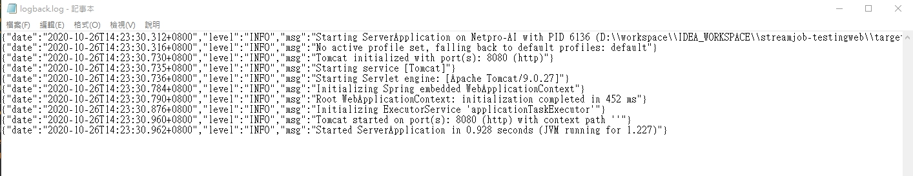

# 利用 logback-logstash 產生 json 版本的 log 資訊

<br>

上班的時候遇到一個機車需求，要生出一個可以產出 json 版本 log 的 web server。說到做一個 web server 當然就選最拿手的 Spring Boot 來做喽，只是 json 版本的 log 從來沒見過，所以查了一些資料發現 logback-logstash 可以很好的解決我德問題。這邊紀錄一下使用方式，方便以後需要時使用。

[logback-logstash 的 Github 鏈結](https://github.com/logstash/logstash-logback-encoder)


<br>

----

<br>

關於怎麼建立一個 web server 這邊不會解釋，直接看怎麼部屬 logback-logstash。

首先看一下 pom.xml 依賴 : 

```xml
<dependency>
    <groupId>net.logstash.logback</groupId>
    <artifactId>logstash-logback-encoder</artifactId>
    <version>6.4</version>
</dependency>
```

<br>
<br>

然後我們需要在 `src\main\resources` 資料夾中建立一個 `logback-logstash.xml` 文件。

具體內容如下，細節解釋會寫在註解中:

```xml
<?xml version="1.0" encoding="UTF-8"?>
<configuration scan="true" scanPeriod="30 seconds" packagingData="true">
    <include resource="org/springframework/boot/logging/logback/base.xml"/>

    <contextName>logback</contextName>

    <!--設定一個 log 存放的地點-->
    <property name="log.path" value="D:\\test\\logback.log"/>

    <!--第一個 appender 是設定 console 輸出-->
    <appender name="STDOUT" class="ch.qos.logback.core.ConsoleAppender">
        <encoder class="net.logstash.logback.encoder.LoggingEventCompositeJsonEncoder">
            <jsonGeneratorDecorator
                    class="net.logstash.logback.decorate.FeatureJsonGeneratorDecorator"/>
            <providers>
                <pattern>
                    <pattern>
                        {
                        "date": "%date{yyyy-MM-dd'T'HH:mm:ss.SSSZ}",
                        "level": "%level",
                        "msg": "%msg"
                        }
                    </pattern>
                </pattern>
            </providers>
        </encoder>
    </appender>

    <!--第二個 appender 是設定落地檔輸出-->
    <appender name="FILE" class="ch.qos.logback.core.rolling.RollingFileAppender">
        <file>${log.path}</file>
        <rollingPolicy class="ch.qos.logback.core.rolling.TimeBasedRollingPolicy">
            <!--檔案切分-->
            <fileNamePattern>logback.%d{yyyy-MM-dd}.log</fileNamePattern>
        </rollingPolicy>
        <encoder class="net.logstash.logback.encoder.LoggingEventCompositeJsonEncoder">
            <jsonGeneratorDecorator
                    class="net.logstash.logback.decorate.FeatureJsonGeneratorDecorator"/>
            <providers>
                <pattern>
                    <pattern>
                        {
                        "date": "%date{yyyy-MM-dd'T'HH:mm:ss.SSSZ}",
                        "level": "%level",
                        "msg": "%msg"
                        }
                    </pattern>
                </pattern>
            </providers>
        </encoder>
    </appender>

    <root level="info">
        <appender-ref ref="STDOUT"/>
        <appender-ref ref="FILE"/>
    </root>
</configuration>
```

<br>
<br>

最後一個步驟是在 `src\main\resources` 的 `application.properities` 裡面加入一行: 

```properities
## Log Properties
logging.config=classpath:logback-logstash.xml
```

<br>
<br>

以上完成之後啟動 server 可以看到 file 的 output : 

