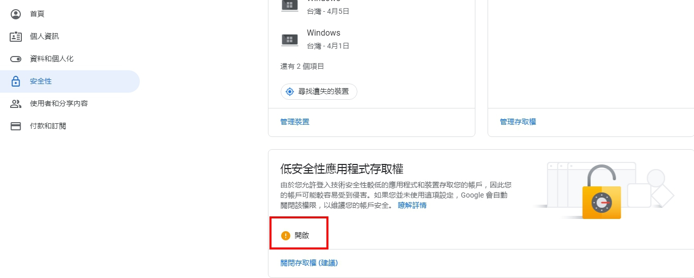

# 利用 Gmail 寄送驗證碼

<br>

在做專題的時候，需要做到幫新的 User 驗證 Email，這邊就把配置及使用的詳細實作過程記錄下來。

<br>

---

<br>

## 目錄

1. [pom.xml 依賴](#pom)

2. [建立 Bean Config](#config)

2. [編寫測試](#test)

<br>
<br>

<div id="pom">

## pom.xml 依賴

首先來看一下 pom.xml 依賴，在做專題時使用 Spring Web，這邊只記錄 Spring Boot Mail 如何配置及使用，所已只使用我們需要用到的依賴 : 

```xml
<properties>
        <spring.boot.version>2.2.1.RELEASE</spring.boot.version>
</properties>

...

<!-- spring boot mail 依賴 -->
<dependency>
    <groupId>org.springframework.boot</groupId>
    <artifactId>spring-boot-starter-mail</artifactId>
    <version>${spring.boot.version}</version>
</dependency>

<!-- spring boot 測試依賴 -->
<dependency>
    <groupId>org.springframework.boot</groupId>
    <artifactId>spring-boot-starter-test</artifactId>
    <version>${spring.boot.version}</version>
    <scope>test</scope>
</dependency>

...
```

<br>
<br>

<div id="config">

## 建立 Bean Config

我們要幫 MailService 建立一個 Bean，之後我們所有郵件發送全部交給這個 Bean 來處理。

建立檔案 config/MailServiceConfig.java: 

```java
import org.springframework.context.annotation.Bean;
import org.springframework.context.annotation.Configuration;
import org.springframework.mail.javamail.JavaMailSender;
import org.springframework.mail.javamail.JavaMailSenderImpl;

import java.util.Properties;

@Configuration
public class MailServiceConfig {
    @Bean
    public JavaMailSender javaMailSender() {
        JavaMailSenderImpl mailSender = new JavaMailSenderImpl();
        // 使用 Gmail SMTP 服務
        mailSender.setHost("smtp.gmail.com");
        mailSender.setPort(587);

        mailSender.setUsername("FrizoStudio@gmail.com");
        mailSender.setPassword("*********");

        Properties props = mailSender.getJavaMailProperties();
        props.put("mail.transport.protocol", "smtp");
        props.put("mail.smtp.auth", "true");
        props.put("mail.smtp.starttls.enable", "true");
        props.put("mail.smtp.starttls.required", "true");
        props.put("mail.debug", "true"); // 實際上線時改 false

        return mailSender;
    }
}
```

我們使用 Gmail 來測試，現在最新的標準是使用 port `587` 作為安全電郵埠號，例如現在 Apple Mail 及 Outlook 也預設使用 port 587, 所以現在提供 email relay 功能，最佳選擇還是 port 578, 而且由於 ISP 沒有將 port 587 封鎖，所以 email server 設定 port 587 給用戶作 relay 也是較方便。

<br>

再來還需要注意一下，我們使用的 Gmail 帳號要設定一下低安全性應用程式存取權。具體步驟如下 : 

登入 Google 帳號 > Google 帳號設定 > 安全性 > 低安全性應用程式存取權 > 開啟



這樣一來，就可以使用我們的 Gmail 帳號發送信件拉。

<br>
<br>

<div id="test">

## 編寫測試

現在我們可以實際測試看看，mail 是否可以正常發送拉，我們編寫測試如下 : 

MailServiceTest.java

```java
@RunWith(SpringJUnit4ClassRunner.class)
@SpringBootTest(classes = MainApplication.class) // Spring 應用的入口文件
public class MailServiceTest {

    @Autowired
    public JavaMailSender mailSender;

    @Test
    public void sendToGmail() throws MessagingException {
        try {
            MimeMessage mimeMessage = mailSender.createMimeMessage();
            MimeMessageHelper messageHelper = new MimeMessageHelper(mimeMessage, true, "UTF-8");
            messageHelper.setFrom("FrizoStudio@gmail.com"); // 發件人
            messageHelper.setSubject("Frizo Email 驗證信件");
            messageHelper.setText(
                    "<p>您好，歡迎加入 Frizo 體驗我們的服務，以下是您的帳號的驗證碼，請在收到信件後立即驗證，此驗證碼將在 3 分鐘後過期。</p>" +
                    "<br>" +
                    "<p>驗證碼 : <strong>" + generateVerifyCode() + "</strong></p>" +
                    "<br>" +
                    "<p>請勿直接回覆信件，謝謝配合。",
                    true);
            messageHelper.setTo("Jarvan1110@gmail.com");  // 收件人
            mailSender.send(mimeMessage);
        } catch (Exception ex) {
            throw new RuntimeException("JavaMailSender encounter some problems");
        }
    }

    public String generateVerifyCode() {
        StringBuilder sb = new StringBuilder();
        new Random().ints(6, 0, 10).forEach(sb::append);
        String verifyCode = sb.toString();
        return verifyCode;
    }
}
```

<br>

這邊有一點需要注意，因為我們發送的 mail 希望使用 html 的排版方式，所以我們需要使用 `MimeMessage` 類別來當作訊息載體。

`MimeMessageHelper` 建構時的第二個參數是 boolean 值，當值為 `true` 時，表示訊息有附件或者使用 html 排版。

<br>

以上就是本文全部內容。