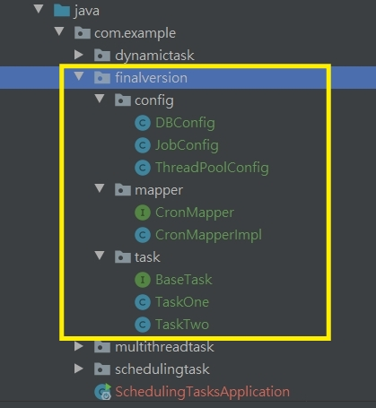

# Spring Schedule（排程 Job）

<br>

--------------------------------


<br>

Spring Schedule，支持在 Spring 專案中編寫工作排程，週期定時執行工作。

其實實作上並不難，接下來就簡單介紹一下。

<br>

以下所有示範我都有實作，專案就放在這個目錄裡，專案名稱叫做 [scheduling-tasks-complete](scheduling-tasks-complete)

<br>

## 加入依賴

<br>

新建專案，依賴簡單的用 pring-boot-starter 就夠了。

```xml
<dependency>
    <groupId>org.springframework.boot</groupId>
    <artifactId>spring-boot-starter</artifactId>
    <version>2.7.2</version>
</dependency>
```

<br>
<br>
<br>
<br>

## Spring Boot 主程式

<br>

在 Spring Boot 主程式我們需要加入排程註解：

<br>

```java
@SpringBootApplication
@EnableScheduling // 開啟排程功能
public class SchedulingTasksApplication {
    public static void main(String[] args) {
        SpringApplication.run(SchedulingTasksApplication.class);
    }
}
```

<br>
<br>
<br>
<br>

## 簡單的單執行緒排程

<br>

先來一個簡單的單執行緒排程：

<br>

```java
@Component // 標註起來就會被 SpringContext 當成 Spring Bean 管理
public class ScheduledTask {

    private static final Logger log = LoggerFactory.getLogger(ScheduledTask.class);

    private static final SimpleDateFormat dateFormat = new SimpleDateFormat("HH:mm:ss");

    @Scheduled(fixedRate = 5000) // 每 5 秒執行一次
    public void reportCurrentTime1() throws InterruptedException {
        Thread.sleep(5000L);
        log.info("Now time1 is: {}", dateFormat.format(new Date()));
    }

    @Scheduled(fixedRate = 5000) // 每 5 秒執行一次
    public void reportCurrentTime2() throws InterruptedException {
        Thread.sleep(5000L);
        log.info("Now time2 is: {}", dateFormat.format(new Date()));
    }
}
```

<br>

東西很簡單，Spring Boot 啟動之後，會把這個標註了 `@Component` 的類別實例化並管理。標註 `@Scheduled` 的功能就會排程執行。

這裡建立 2 個 job，是想要說明這種寫法是單執行緒的。其中一個 job 完成才會執行下一個。如果專案中有很多排程卡到差不多同時間進行，就會遇到阻塞問題。當然，只有少量或單一工作時，這種方法簡單解決就可以了。

<br>

```
2022-08-09 23:07:39.075  INFO 14348 --- [   scheduling-1] c.example.schedulingtask.ScheduledTask   : Now time1 is: 23:07:39
2022-08-09 23:07:44.086  INFO 14348 --- [   scheduling-1] c.example.schedulingtask.ScheduledTask   : Now time2 is: 23:07:44
2022-08-09 23:07:49.089  INFO 14348 --- [   scheduling-1] c.example.schedulingtask.ScheduledTask   : Now time1 is: 23:07:49
2022-08-09 23:07:54.091  INFO 14348 --- [   scheduling-1] c.example.schedulingtask.ScheduledTask   : Now time2 is: 23:07:54
```

<br>

注意看，兩個 Task 交替執行，一個 Task 會阻塞 5 秒。

<br>
<br>
<br>
<br>

## 簡單的多執行緒排程

<br>

多執行緒排程也不難，加一個註解就好了：

<br>

```java
@Component
@EnableAsync // 開啟多執行緒
public class MultithreadScheduleTask {

    @Async
    @Scheduled(fixedDelay = 1000)  //延遲 1 秒
    public void first() throws InterruptedException {
        System.out.println("Task-1 : " + LocalDateTime.now().toLocalTime() + "\r\nThread: " + Thread.currentThread().getName());
        System.out.println();
        Thread.sleep(1000 * 10); // 暫停一秒
    }

    @Async
    @Scheduled(fixedDelay = 2000) //延遲 2 秒
    public void second() {
        System.out.println("Task-2 : " + LocalDateTime.now().toLocalTime() + "\r\nThread : " + Thread.currentThread().getName());
        System.out.println();
    }

    // 理論上兩個 Task 都會同時執行
}
```

<br>

看結果：

<br>

```
Task-1 : 23:46:35.630
Thread: task-1

Task-2 : 23:46:35.630
Thread : task-2

Task-1 : 23:46:36.626
Thread: task-3

Task-2 : 23:46:37.636
Thread : task-4

Task-1 : 23:46:37.636
Thread: task-5
...
```

<br>

每次 task 執行都交給不同 Thread 執行。

<br>
<br>
<br>
<br>

## 專案應用級：動態決定任務排程週期

<br>

專案性質看過來 ！！！

<br>

當我們需要多執行緒，且可動態決定任務排程週期，就用以下方法。

<br>

### 首先建立 ThreadPool，以供排程任務使用

<br>

```java
public class WorkerPool {
    // 注意必須是 ScheduledThreadPool
    // 這裡開一個 pool 供所有排程任務使用
    public static ExecutorService workers = Executors.newScheduledThreadPool(20);

}
```
<br>
<br>

建立 __DynamicScheduleTask__ 設定類別，實作 __SchedulingConfigurer__ 介面：

<br>

```java
@Configuration
public class DynamicScheduleTask implements SchedulingConfigurer {

    @Override
    public void configureTasks(ScheduledTaskRegistrar taskRegistrar) {
        // 指定 ThreadPool 不加這一段會變成單 Thread
        taskRegistrar.setScheduler(WorkerPool.workers); 

        // 添加 Runnable 任務內容
        taskRegistrar.addTriggerTask(
                () -> {
                    System.out.println("執行動態定時任務: " + LocalDateTime.now().toLocalTime());
                    try {
                        Thread.sleep(5000L); // 停滯 5 秒
                    } catch (InterruptedException e) {
                        throw new RuntimeException(e);
                    }
                },

                // 設定執行週期
                triggerContext -> {
                    // #1 取得 corn 
                    String cron = "0/5 * * * * ?"; // 可以從 DB 裡讀取 corn
                    // 驗證合法性
                    if (StringUtils.isEmpty(cron)) {
                        // Omitted Code ..
                    }
                    //2.3 返回 CronTrigger
                    return new CronTrigger(cron).nextExecutionTime(triggerContext);
                }
        );
    }

}
```

<br>

這裡有 1 個點需要重點解釋一下：

上述程式 __#1__ 處，取得 cron expression，這個 cron expression 可以理解是一種排程專用的排程時間表達式。

<br>

corn expression 文件

https://docs.oracle.com/cd/E12058_01/doc/doc.1014/e12030/cron_expressions.htm

<br>

簡單解釋一下 cron expression 怎麼用，以下簡稱 cron

cron 有 6 ~ 7 個可選填欄位，格式為 X X X X X X X ，中間用空格區分。每一個 X 代表的意思不同，分別為

|   | X | X | X | X | X | X | X |
| :-: | :-: | :-: | :-: | :-: | :-: | :-: | :-: |
| 意義 | 秒 | 分 | 時 | 日 | 月 | 周 | 年 |
| 是否必要 | ✔️ | ✔️ | ✔️ | ✔️ | ✔️ | ✔️ | ✕ |
| 取值範圍 | 0~59 | 0~59 | 0~23 | 1~31 | 1~12 或[JAN, DEC] | 1~7 或[MON, SUN] | [當前年分，2099] |

<br>

除此之外還有特殊字符，例如 `*` 代表所有可能值，`/` 指定數值增量，`?` 不指定值（只有日跟周支持這個字符）等等。更多細節這裡就不贅述了。

<br>

最後再給幾個範例看一下：

<br>

| 範例 | 意義 |
| :-: | :-:  | 
|0 15 10 ? * *| 每天 10:15|
|0 0 10,14,16 * * ?| 每天10:00 14:00 16:00|
|0 0/30 9-17 * * ?| 每天 09:00 到下午 17:00，每半小時一次|
|0 * 14 * * ?| 每天 14:00 到 14:59 的每一分鐘|
|0 0 12 ? * WED| 每周三中午 12:00|
|0 15 10 ? * * 2022| 2022 年每天 10:15|

<br>
<br>

言歸正傳，範例中使用 `"0/5 * * * * ?"` 表示每五秒跑一次任務。這個 cron 可以通過 database 達到隨時改變的功能。這意味著不需要重啟 Server 就可以改變排程時間設定。

假如我們用的是 MyBatis，弄一張 Table 存 cron 值。我們就可以裝配這個 Mapper：

<br>

Table: cron_detail

| id | cron |
| :-: | :-: |
| 1 | 0/5 * * * * ? |
| 2 | 0/8 * * * * ? |
| ... | ... |

<br>

```java
@Autowired// 自動裝配
CronMapper cronMapper;
```

<br>

設定 triggerContext 時可以這樣：

<br>

```java
// 設定執行週期
triggerContext -> {
    // #1 取得 corn 
    String cron = cronMapper.getCronById(1); // 可以從 DB 裡讀取 corn
    // 驗證合法性
    if (StringUtils.isEmpty(cron)) {
        // Omitted Code ..
    }
    //2.3 返回 CronTrigger
    return new CronTrigger(cron).nextExecutionTime(triggerContext);
}
```

<br>
<br>
<br>
<br>

## Final version

<br>

最後，我配置了一套正式的結構供以後參考。完整結構在 [scheduling-tasks-complete](scheduling-tasks-complete) 的 com.example.finalversion 模組中。需要時可以去看一下。

<br>



