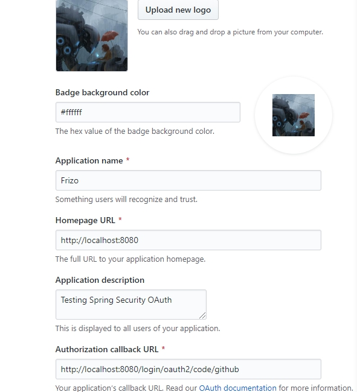
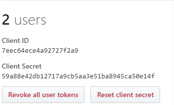

# Spring Security Oauth2 實現 github 快捷登入

<br>

利用 Spring Security 對 Oauth2 良好的封裝，我們可以快速的搭建一個 GitHub 快捷登入功能。

實際範例上還包括　facebook 登入，由於配置方法與 github 一致，所以先不提。

<br>

---

<br>

## 目錄

* 一. [pom.xml 依賴配置](#pom)

* 二. [註冊 github application](#github)

* 三. [application.yml 配置](#yml)

* 四. [Main class 與 Controller](#etc)

* 五. [測試](#test)

<br>

---

<br>

<div id="pom">

### 一. pom.xml 依賴配置 [（看完整）](./learn-oauth\pom.xml)

* 版本資訊 : 
    ```xml
    <properties>
        <spring.boot.version>2.2.1.RELEASE</spring.boot.version>
        <spring.version>5.2.1.RELEASE</spring.version>
        <maven.compiler.version>3.8.1</maven.compiler.version>
        <maven.resource.version>3.1.0</maven.resource.version>
    </properties>
    ```

    <br>

* jar 檔依賴 : 

    ```xml
    <dependency>
        <groupId>org.springframework.boot</groupId>
        <artifactId>spring-boot-starter-web</artifactId>
        <version>${spring.boot.version}</version>
    </dependency>

    <dependency>
        <groupId>org.springframework.boot</groupId>
        <artifactId>spring-boot-starter-security</artifactId>
        <version>${spring.boot.version}</version>
    </dependency>

    <dependency>
        <groupId>org.springframework.security</groupId>
        <artifactId>spring-security-config</artifactId>
        <version>${spring.version}</version>
    </dependency>

    <dependency>
        <groupId>org.springframework.security</groupId>
        <artifactId>spring-security-oauth2-client</artifactId>
        <version>${spring.version}</version>
    </dependency>

    <dependency>
        <groupId>org.springframework.security</groupId>
        <artifactId>spring-security-oauth2-jose</artifactId>
        <version>${spring.version}</version>
    </dependency>
    ```

    <br/>

*  ```<build>``` 部分略過，有需要可以查看 [此篇筆記](../../../plugin/mavenPlugin)

<br>

---

<br>

<div id="pom">

### 二. 註冊 github application

* 註冊網址 :

  https://github.com/settings/apps/new

  按照提示填寫應用資料如下 : 

  

  Homepage URL 開發階段先填寫 http://localhost:8080。

  Callback URL 一定要按照圖片上面填寫 http://localhost:8080/login/oauth2/callback 。

  按下確認之後，就可以取得 Client ID 以及 Client Secret

  


<br>

---

<br>

<div id="pom">

### 三. application.yml 配置 [（看完整）](./learn-oauth\src\main\resources/config/application.yml)

* code example :

    ```yml
    # Spring Config
    spring:

    # OAuth2
    security:
        oauth2:
        client:
            registration:
            github: #github 是 registration 屬性的唯一 ID
                client-id: 7eec64ece4a92727f2a9
                client-secret: 59a88e42db12717a9cb5aa3e51ba8945ca50e14f
    ```
    把 client-id 跟 client-secret 填上即可。

<br>

---

<br>


<div id="pom">

### 四. Main class 與 Controller

* Main class : OauthApplication [（看完整）](./learn-oauth\src\main\java\com\frizo\learn\oauth\OauthApplication.java)

    ```java
    @SpringBootApplication
    public class OauthApplication {
        public static void main(String[] args) {
            SpringApplication.run(OauthApplication.class, args);
        }
    }
    ```

<br>


* Controller : SimpleController [（看完整）](./learn-oauth\src\main\java\com\frizo\learn\oauth\controller/SimpleController.java)

    ```java
    @RestController
    public class SimpleController {
        @GetMapping("/hello")
        public String hello(Principal principal){
            Authentication authentication = SecurityContextHolder.getContext().getAuthentication();
            JSONObject jsonObject = new JSONObject();
            jsonObject.put("authName", authentication.getName());
            jsonObject.put("principal", authentication.getPrincipal().toString());
            return jsonObject.toJSONString();
        }
    }
    ```

<br>

---

<br>

<div id="test">

### 五. 測試

* 啟動應用之後，直接訪問 http://localhost:8080/login ，就可以看到系統預設的 Oauth2 Login Page。

* 選擇 github login 登入之後，就可以訪問 http://localhost:8080/hello ，取得 github 用戶授權的帳戶資料 JSON。 