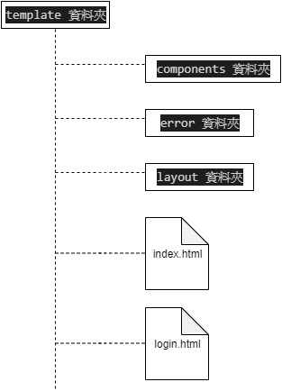

# 配置 Thymeleaf 模板（含 spring security tag）

<br>

為了成功配置好 Thymeleaf 模板，包括 security tag 和 layout 功能，花了我很多時間，出現很多 bug 都是因為版本不相容或者版本異動，配置方法改變。

這邊是我查閱很多資料後的彙總，編寫時間為 2020/1/23 使用的是相對最新版本的 : 

* Spring boot v-2.2.x 
 
* Thymeleaf v-3.x 

* thymeleaf-layout-dialect v-2.x

* thymeleaf-extras-springsecurity5 v-3.0.4
<br>


實際編寫的專案範例沿用 security 筆記的 [webSecurity](../../security/webSecurity) 專案，以供參考使用。

<br>

----------

<br>

## 目錄

* ### 一. [pom.xml 配置及依賴](#pom)

* ### 二. [Thymeleaf 的進階設計技巧（layout components）](#thymeleaf)

* ### 三. [Controller 設計](#controller)

<br>

---

<br/>

## 實作

<br>

<div id="pom"></div>

### 一. pom.xml 配置及依賴

* pom 的重要依賴 :

    * 版本屬性設定，實作時版本盡量保持一致 : 

        ```xml
        <properties>
            <spring.boot.version>2.2.1.RELEASE</spring.boot.version>
            <maven.compiler.version>3.8.1</maven.compiler.version>
            <maven.resource.version>3.1.0</maven.resource.version>
            <thymeleaf.version>3.0.9.RELEASE</thymeleaf.version>
            <thymeleaf-layout-dialect.version>2.2.2</thymeleaf-layout-dialect.version>
            <thymeleaf-extras-security5.version>3.0.4.RELEASE</thymeleaf-extras-security5.version>
        </properties>
        ```
    <br/>

    * 核心依賴
        ```xml
        <!-- spring boot web 自動配置依賴 -->
        <dependency>
            <groupId>org.springframework.boot</groupId>
            <artifactId>spring-boot-starter-web</artifactId>
            <version>${spring.boot.version}</version>
        </dependency>

        <!-- spring boot security 自動配置依賴 -->
        <dependency>
            <groupId>org.springframework.boot</groupId>
            <artifactId>spring-boot-starter-security</artifactId>
            <version>${spring.boot.version}</version>
        </dependency>

        <!-- thymeleaf 依賴 -->
        <dependency>
            <groupId>org.thymeleaf</groupId>
            <artifactId>thymeleaf</artifactId>
            <version>${thymeleaf.version}</version>
        </dependency>

        <!-- thymeleaf security tag 依賴 -->
        <dependency>
            <groupId>org.thymeleaf.extras</groupId>
            <artifactId>thymeleaf-extras-springsecurity5</artifactId>
            <version>${thymeleaf-extras-security5.version}</version>
        </dependency>

        <!-- thymeleaf layout 依賴 (spring 5 預設已經移除 layout 功能，需要自己添加) -->
        <dependency>
            <groupId>nz.net.ultraq.thymeleaf</groupId>
            <artifactId>thymeleaf-layout-dialect</artifactId>
            <version>${thymeleaf-layout-dialect.version}</version>
        </dependency>
        ```

<br/><br/>

---

<br/><br/>

<div id="thymeleaf">

## 二. Thymeleaf 的進階設計技巧（layout components）

* spring boot 預設的靜態資源存放路徑為 : 

    * files : src/main/resources/static -> 放一些 css js ..

    * files : src/main/resources/public -> 做 SPA 才用的到

<br/>

* spring boot 預設的模板存放路徑為 files : src/main/resources/templates

    我們在這個路徑下建立一組資料夾，結構如下 :

    

    說明 :

    使用 Component 與 Layout 開發模式，基本上只需要一個 index.html 就足夠了。當 Contoller 丟 model 到模板時，再動態取得 ComponentName 做渲染，也就是說，接收所有 model 的主體模板都是 index.html。

    layout 則是放置一個預設模板，index.html 繼承此模板，於是 index.html 不用寫 header 與 footer 就可以一直使用父類 (layout.html) 的了。index.html 只需要把要渲染的 component 丟到父類 (layout.html) 的 content 區塊就可以了。

    error 資料夾是用來放置錯誤頁，例如 404.html 500.html，注意 : 404.html 是 Spring Boot 預設用來顯示回應 Page Not Found 的頁面，最好就以 404.html 來命名。


<br/>
<br/>

* 先寫一個 Login.html 來壓壓驚吧。

    login.html [（看完整）](../../security/webSecurity/spring-web-security/src/main/resources/templates/login.html)

    * 開頭部分要先註冊 thymeleaf tag，不然 html 是不認你這樣寫 ```th:xx``` 的

        ```html
        <!DOCTYPE html>
        <html xmlns:th="http://www.thymeleaf.org"
              xmlns:sec="http://www.thymeleaf.org/thymeleaf-extras-springsecurity5"
              xmlns:layout="http://www.ultraq.net.nz/web/thymeleaf/layout">
        ```

        <br/>

    * ```<head>``` 部分添加 link 時這樣寫 :  ```th:href="@{/path}"``` 模板渲染時就可以在 path 前加上 contextPath

        ```html
        <head>
            <meta charset="UTF-8">
            <title>登入頁</title>
            <link rel="shortcut icon" th:href="@{/favicon.ico}">
            <link rel="stylesheet" th:href="@{/css/bootstrap.css}">
            <link rel="stylesheet" th:href="@{/css/main.css}">
            <script th:src="@{/js/jquery-3.4.1.js}"></script>
            <script th:src="@{/js/bootstrap.js}"></script>
            <script th:src="@{/js/main.js}"></script>
        </head>
        ```

        <br/>

    * ```<body>``` 部分使用了 header.html 與 footer.html 這兩個 component 做渲染，中間的 ```<div id="logInContent">```則用來自訂登入介面。

        ```html
        <body>
        <header th:include="/components/header"></header>

        <!-- 登入Div -->
        <div id="logInContent">
            ... Login Form...
        </div>

        <footer th:include="/components/footer"></header>

        </body>
        ```

        <br/>

    * LogInContent 的部分因為使用 Bootstrap4 做的設計，所以 code 這邊只列出相關的重點。

        ```th:if="${param.error}"``` 是當 server 端驗身份失敗後會傳 param 到模板，這邊一旦收到此 error 訊息，就顯示提示訊息。

        ```th:action="@{/login}"``` 是模板渲染這個 tag 時順便把 contextPath 一起帶上。

        ```html
        <p th:if="${param.error}">帳號或密碼有錯誤，請重試。</p>
        <form name="form" th:action="@{/login}" action="/login" method="post">
            <input type="text" placeholder="請輸入帳號" name="username"/>
            <input type="password" placeholder="請輸入密碼" name="password"/>
            <input type="submit" value="登入" id="logInBtn">
        </form>
        ```

    <br>
    <br>

* component : header.html [（看完整）](../../security/webSecurity/spring-web-security/src/main/resources/templates/components/header.html)

    * header.html 這個組件只是 index.html 所需要的一部分而已，所以只需要寫原本 index.html 的  ```<header>``` 中所需的內容就好

        ```html
        <!-- 頂 -->
        <div id="top">
            <div sec:authorize="isAuthenticated()" id="goHome">
                <span><a th:href="@{/index}">回首頁</a></span>
            </div>

            Spring Web Security 測試

            <div sec:authorize="isAuthenticated()" id="logout">
                <button type="button" onclick="logout()">登出</button>
            </div>
        </div>
        ```

        [footer.html](../../security/webSecurity/spring-web-security/src/main/resources/templates/components/footer.html) 同理，這邊就不列舉了

    <br>
    <br>

* index.html [（看完整）](../../security/webSecurity/spring-web-security/src/main/resources/templates/index.html)

    * 程式碼 : 

        ```html
        <!DOCTYPE html>
        <html xmlns="http://www.w3.org/1999/xhtml"
            xmlns:th="http://www.thymeleaf.org"
            xmlns:sec="http://www.thymeleaf.org/thymeleaf-extras-springsecurity5"
            xmlns:layout="http://www.ultraq.net.nz/web/thymeleaf/layout"
            layout:decorator="layout/layout">

        <body>
        <section layout:fragment="content">
            <section th:include="${componentName}"></section>
        </section>
        </body>

        </html>
        ```
    
    <br/>

    * <strong>注意 : </strong>開頭部分要先註冊 thymeleaf tag 等，這邊不再重複贅述，直接看 ```<html>``` 的屬性 ```layout:decorator="layout/layout"``` :

        * 這個屬性的意思是繼承 layout/layout.html 這個模板，我們先看一下 [layout.html](../../security/webSecurity/spring-web-security/src/main/resources/templates/layout/layout.html) 是如何編寫的 :
        
            ```html
            <!DOCTYPE html>
            <html xmlns="http://www.w3.org/1999/xhtml"
                xmlns:th="http://www.thymeleaf.org"
                xmlns:sec="http://www.thymeleaf.org/thymeleaf-extras-springsecurity5"
                xmlns:layout="http://www.ultraq.net.nz/web/thymeleaf/layout">

            <head>
                <meta charset="UTF-8">
                <title>模板頁</title>
                <link rel="shortcut icon" th:href="@{/favicon.ico}">
                <link rel="stylesheet" th:href="@{/css/bootstrap.css}">
                <link rel="stylesheet" th:href="@{/css/main.css}">
                <script th:src="@{/js/jquery-3.4.1.js}"></script>
                <script th:src="@{/js/bootstrap.js}"></script>
                <script th:src="@{/js/main.js}"></script>
            </head>

            <body>
            <div id="container">
                <header th:include="/components/header"></header>

                <div id="mainContent">
                    <section th:include="/components/side_nav_bar"></section>

                    <section id="popArea" layout:fragment="content"></section>
                </div>

                <footer th:include="/components/footer"></footer>
            </div>
            </body>

            </html>
            ```

        * 這樣一來，所有繼承 layout.html 的模板都會長的跟它一樣，除了 ```<section id="popArea" layout:fragment="content"></section>```

        * 當區塊設定屬性 ```layout:fragment="content"``` 時，子類模板們就可以透過複寫同樣區塊從而達到客製化目的，例如 index.html 中複寫區塊 : 
            ```java
            <section layout:fragment="content">
                <section th:include="${componentName}"></section>
            </section>
            ```

    <br/>
    <br/>

    * index.html 中的 ```th:include="${componentName}"``` 動態取得 Controller 給的數值，從而達到動態切換 component 的效果。

        

    <br/>
    <br/>

---

<br/>
<br/>

<div id="controller">

### 三. Controller 設計 [（看完整）](../../security/webSecurity/spring-web-security/src/main/java/com/frizo/note/spring/web/security/controller/BaseController.java)

* Controller Example : 

    ```java
    @Controller
    public class BaseController {
        @GetMapping("/login")
        public String getLoginPage(){
            return "login";
        }

        @GetMapping(value = {"/", "/index"})
        public ModelAndView getIndex(){
            // 取出登入者的認證資訊
            Authentication auth = SecurityContextHolder.getContext().getAuthentication();
            ModelAndView mav = new ModelAndView();
            // 設定使用 index.html 作為模板
            mav.setViewName("index");
            // 告知 index.html 用 welcome.html 這個組件做頁面渲染。
            mav.addObject("componentName", "/components/welcome.html"); 
            // 傳入登入 USER 資料
            mav.addObject("name", auth.getName());
            mav.addObject("auths", auth.getAuthorities());
            return mav;
        }
    }
    ```


    