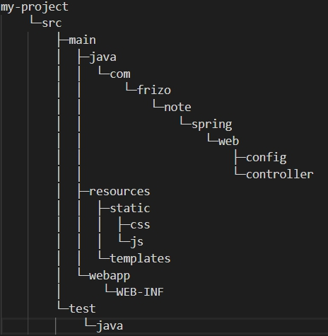

# 打包 war 檔部屬到 Tomcat 9

<br>

spring boot 專案打包進 Tomcat 的筆記。

這邊使用的版本為資訊 : 

* spring boot 2.x
* Tomcat 9

<br>

---

<br>

## 目錄

* 一. [pom.xml 配置及依賴](#pom)

* 二. [專案資料夾結構](#floder)

* 三. [Main class : MyProjectApplication](#main)

* 四. [打包部屬](#package)


<br>

---

<br>

<div id="pom">

### 一. pom.xml 配置及依賴 [（看完整）](./my-project/pom.xml)

* 依賴版本及打包資訊 : 

    ```xml
    <groupId>com.frizo.note</groupId>
    <artifactId>my-project</artifactId>
    <version>1.0-SNAPSHOT</version>
    <name>my-project</name>
    <packaging>war</packaging>

    <properties>
    <spring.boot.version>2.2.1.RELEASE</spring.boot.version>
    <maven.compiler.version>3.8.1</maven.compiler.version>
        <maven.resource.version>3.1.0</maven.resource.version>
        <start-class>com.frizo.note.spring.web.MyProjectApplication</start-class>
    </properties>
    ```

    ```<packaging>#</packaging>``` 一定要指定為 war 這樣打包時才會包成 war 檔。

    <br/>

* jar檔依賴 : 

    ```xml
    <!-- spring boot web 自動配置依賴 -->
    <dependency>
        <groupId>org.springframework.boot</groupId>
        <artifactId>spring-boot-starter-web</artifactId>
        <version>${spring.boot.version}</version>
    </dependency>

    <!-- spring boot tomcat 依賴僅限於編譯時期提供 -->
    <dependency>
        <groupId>org.springframework.boot</groupId>
        <artifactId>spring-boot-starter-tomcat</artifactId>
        <version>${spring.boot.version}</version>
        <scope>provided</scope>
    </dependency>

    <!-- spring boot thymeleaf 自動配置依賴 -->
    <dependency>
        <groupId>org.springframework.boot</groupId>
        <artifactId>spring-boot-starter-thymeleaf</artifactId>
        <version>${spring.boot.version}</version>
    </dependency>
    ```

    這邊要注意一下，因為 spring boot 本身帶有內置 Tomcat 的依賴，雖然包成 war 檔之後不需要自帶的 Tomcat，但是 Spring Boot 編譯打包時還是需要有 Tomcat 依賴，所以我們這邊在依賴上標註 ```<scope>provided</scope>``` 就可以了，表示僅在編譯期間提供依賴資源。

    <br/>

* ```<build>``` 配置 : 

    ```xml
    <build>

        <finalName>${project.name}</finalName>

        <plugins>

            ...maven compiler 略...

            <plugin>
                <groupId>org.springframework.boot</groupId>
                <artifactId>spring-boot-maven-plugin</artifactId>
                <version>${spring.boot.version}</version>
                <configuration>
                    <addResources>true</addResources>
                    <mainClass>${start-class}</mainClass>
                    <layout>WAR</layout>
                </configuration>
                <executions>
                    <execution>
                        <goals>
                            <goal>repackage</goal>
                        </goals>
                    </execution>
                </executions>
            </plugin>

        <plugins>

    </build>
    ```

    * ```<finalName>${project.name}</finalName>```指定好 final name 後，打包的 war 檔名稱就是 ```專案名稱.war```

    * spring boot plugin 配置就不多說了，直接照貼。

<br>
<br>

---

<br>
<br>

<div id="floder"></div>

### 二. 專案資料夾結構

* 資料夾結構樹狀圖 : 

    

    main 中有 3 個資料夾，java 與 resources 就不提了。這邊要注意一下 <strong>webapp</strong> 資料夾

    要想打包 maven 專案成 war 檔，就一定要有 <strong>web.xml</strong> 檔案，雖然 servlet 3.0 後就不太用的到了，但是打包期間還是需要有的。web.xml 放置的位置就在 ```src/main/webapp/WEB-INF```

    web.xml 全部內容如下 : 

    ```xml
    <!DOCTYPE web-app PUBLIC
        "-//Sun Microsystems, Inc.//DTD Web Application 2.3//EN"
        "http://java.sun.com/dtd/web-app_2_3.dtd">
    <web-app>
        <display-name>Archetype Created Web Application</display-name>
    </web-app>
    ```

<br/>
<br/>

---

<br/>
<br/>

<div id="main"></div>

### 三. Main class : MyProjectApplication[（看完整）](./my-project/src/main/java/com/frizo/note/spring/web/MyProjectApplication.java)
* code example : 

    ```java
    @SpringBootApplication
    public class MyProjectApplication extends SpringBootServletInitializer {
        // 要想包成 war 部屬到 tomcat 上，就必須如此複寫configure方法。
        @Override
        protected SpringApplicationBuilder configure(SpringApplicationBuilder application) {
            return application.sources(MyProjectApplication.class);
        }

        public static void main(String[] args) {
            SpringApplication.run(MyProjectApplication.class, args);
        }
    }
    ```

* Main class 繼承 SpringBootServletInitializer

* SpringBootServletInitializer 又繼承了 WebApplicationInitializer
  
* WebApplicationInitializer 是 Spring 3.1 新增介面，實作此介面的類別，不需額外宣告，會自動被 SpringServletContainerInitializer 偵測、自動呼叫註冊所需的相關方法

* 注意!!! : Servlet 3.0 以上才支援XD；Servlet 2.5 之前的版本還是只能透過 web.xml 方式註冊 ApplicationContext 及 DispatcherServlet


<br>
<br>

------------------------

<br>
<br>

<div id="package"></div>

### 四. 打包部屬

* 打包指令 : 

    ```bash
    cd my-project
    mvn clean package
    mvn spring-boot:repackage
    ```

    要先用 maven package 打包，然後再用 spring-boot-plugin 重包。指令運行完稱后，在 target 資料夾中會看到 ```my-project.war``` 檔案。

    <br/>

* 部屬到 Tomcat （注意　!　這邊是以 Tomcat 9 為示範）

  複製 ```my-project.war``` 到 ```apache-tomcat/webapp/``` 下，然後 cd 到 ```apache-tomcat/bin``` 運行 ```startup.bat``` 或 ```startup.sh```。

  等到 cmd 上面 log 跑完之後，就可以到 http://localhost:8080/my-project 檢查是否成功了。

  <strong>注意 !!  localhost:8080/ 後接的 context-path 預設就是 war 檔名稱。</strong>

